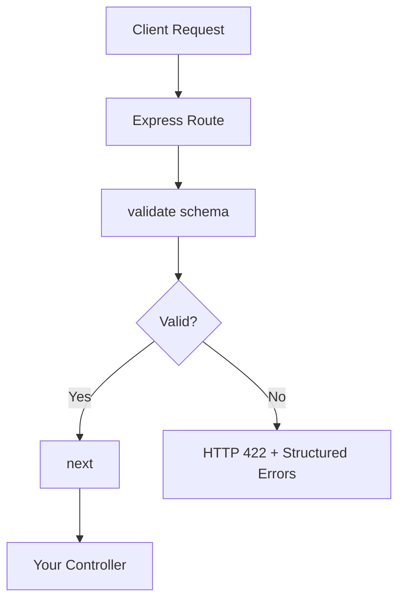

# api-contract-guard

[](https://www.npmjs.com/package/api-contract-guard)
[](./LICENSE)
[](#testing)

Lightweight Express middleware for validating request bodies against reusable, developer-defined schemas — before the request reaches your controller.

## Why

Manual request validation in Express becomes repetitive fast, and the logic ends up scattered across routes:

```js
if (!req.body.email) {
  return res.status(400).json({ error: "Email is required" });
}
if (typeof req.body.age !== "number") {
  return res.status(400).json({ error: "Age must be a number" });
}
```

`api-contract-guard` replaces this with one reusable schema and a single line of middleware:

```js
app.post("/users", validate(userSchema), createUser);
```

## Features

- Required-field validation
- Type checking — `string`, `number`, `boolean`, `email`
- Numeric range validation — `min`, `max`
- String length validation — `minLength`, `maxLength`
- Multiple field errors reported in one response
- Works as standard Express middleware

## Installation

```bash
npm install api-contract-guard
```

This package is designed for use inside an Express application.

## Quick Start

```js
const express = require("express");
const { validate } = require("api-contract-guard");

const app = express();
app.use(express.json());

const userSchema = {
  name:  { type: "string", required: true, minLength: 2 },
  email: { type: "email",  required: true },
  age:   { type: "number", required: true, min: 18 }
};

app.post("/users", validate(userSchema), (req, res) => {
  res.status(201).json({ success: true, data: req.body });
});

app.listen(3000);
```

## How It Works



A valid request passes through `next()` unchanged and reaches your controller. An invalid request never reaches the controller — the middleware responds directly with `422` and a structured, field-by-field error object.

## Validation Behavior

- Checked in order per field: **`required` → `type` → `min` / `max` / `minLength` / `maxLength`**.
- If a field fails `required` or `type`, its remaining rules are skipped — but every other field is still checked.
- Only one error message is returned per failing field.
- Multiple failing fields are reported together in the same response.
- `required` fails only on `undefined`, `null`, or `""`. `0`, `false`, and whitespace-only strings are treated as present.
- `type: "number"` rejects `NaN`.
- `type: "email"` checks basic format only — it does not verify that the address exists or is deliverable.
- `min` / `max` boundaries are inclusive.
- `minLength` / `maxLength` boundaries are inclusive.
- On failure, `next()` is never called.

## Schema Definition

```js
const userSchema = {
  name: {
    type: "string",
    required: true,
    minLength: 2
  },
  email: {
    type: "email",
    required: true
  },
  age: {
    type: "number",
    required: true,
    min: 18,
    max: 100
  }
};
```

## Validation Rules

| Rule | Type | Description | Example |
|---|---|---|---|
| `required` | boolean | Field must not be missing | `required: true` |
| `type` | string | Expected data type — `string`, `number`, `boolean`, or `email` | `type: "number"` |
| `min` | number | Minimum numeric value, inclusive | `min: 18` |
| `max` | number | Maximum numeric value, inclusive | `max: 100` |
| `minLength` | number | Minimum string length, inclusive | `minLength: 2` |
| `maxLength` | number | Maximum string length, inclusive | `maxLength: 30` |

`min`/`max` are intended for numeric fields; `minLength`/`maxLength` are intended for string fields. Pair these with the matching `type` rule for predictable results.

## API Reference

### `validate(schema)`

| Parameter | Type | Description |
|---|---|---|
| `schema` | `object` | Field-by-field validation rules |

**Returns:** an Express middleware function `(req, res, next)`.

| Outcome | Behavior |
|---|---|
| Valid request | `next()` is called |
| Invalid request | Responds with `HTTP 422` and a structured JSON error body; `next()` is **not** called |

## Error Response

```json
{
  "success": false,
  "message": "Validation failed",
  "errors": {
    "email": "Invalid email format",
    "age": "Value must be at least 18"
  }
}
```

| Field | Description |
|---|---|
| `success` | Always `false` on a validation failure |
| `message` | Fixed summary string |
| `errors` | One message per failing field, keyed by field name |

`422 Unprocessable Entity` is used because the request can be syntactically valid JSON while still failing the defined schema — a semantic problem, not a malformed-request problem.

## Examples

**Valid request:**
```bash
curl -X POST http://localhost:3000/users \
  -H "Content-Type: application/json" \
  -d '{"name":"Sachit","email":"sachit@gmail.com","age":20}'
```
```json
{ "success": true, "data": { "name": "Sachit", "email": "sachit@gmail.com", "age": 20 } }
```

**Invalid request:**
```bash
curl -X POST http://localhost:3000/users \
  -H "Content-Type: application/json" \
  -d '{"name":"A","email":"wrong","age":10}'
```

**Multiple validation errors** (from the request above):
```json
{
  "success": false,
  "message": "Validation failed",
  "errors": {
    "name": "Minimum 2 characters required",
    "email": "Invalid email format",
    "age": "Value must be at least 18"
  }
}
```

All three fields fail at once and are reported together, not just the first one.

See [`examples/express-app.js`](./examples/express-app.js) for a runnable demo server.

## Express Integration

```js
app.post("/users", validate(userSchema), createUser);
```

Combine with other middleware normally — `api-contract-guard` does not provide authentication itself:

```js
app.post("/users", authMiddleware, validate(userSchema), createUser);
```

## Real-World Use Cases

| Use case | Example fields validated |
|---|---|
| User registration | `name`, `email`, `age` |
| Login | `email`, `password` (required, type, minLength) |
| Product creation | `title` (required string), `price` (number, min) |
| Checkout | `quantity` (number, min), `address` (required string) |
| User onboarding | `age` (min/max), `weight` / `height` (number) |

## Testing

```bash
npm test
```

4 test suites, 15 tests, all passing — covering required-field validation, `string`/`number`/`boolean`/`email` type checks, `min`/`max`, `minLength`/`maxLength`, and Express middleware behavior (valid requests, invalid requests, and multiple validation errors reported together).

## Security & Scope

`api-contract-guard` is request-validation middleware. It is **not**:

- an authentication or authorization library
- a password-hashing tool
- SQL-injection protection
- a database-level validation layer
- a complete API security solution

Use it alongside, not instead of, proper authentication, authorization, and database-level constraints.

## Limitations

- Validates request body data only — no response validation.
- No `enum` validation.
- No regex/pattern validation.
- No nested-object validation.
- No array validation.
- No custom validator functions.
- No async validators.
- No TypeScript type definitions.
- No automatic OpenAPI/Swagger generation.
- `min`/`max` are intended for numeric values; `minLength`/`maxLength` are intended for strings — pair these with the appropriate `type` rule for predictable validation.

## Future Scope

*Planned only — not currently implemented.*

### v1.2
- Enum validation
- Regex/pattern validation

### v1.3
- Nested objects and arrays
- Custom synchronous validators

### v2.0
- Response validation
- Async validators

### v2.x
- TypeScript definitions

### Future
- OpenAPI integration

## Contributing

1. Fork the repository
2. Create a feature branch
3. Make your changes
4. Add or update tests
5. Run `npm test`
6. Open a pull request

Repository: [github.com/sachityadav-2007/API-Contract-Guard-](https://github.com/sachityadav-2007/API-Contract-Guard-)

## License

[MIT License](./LICENSE)